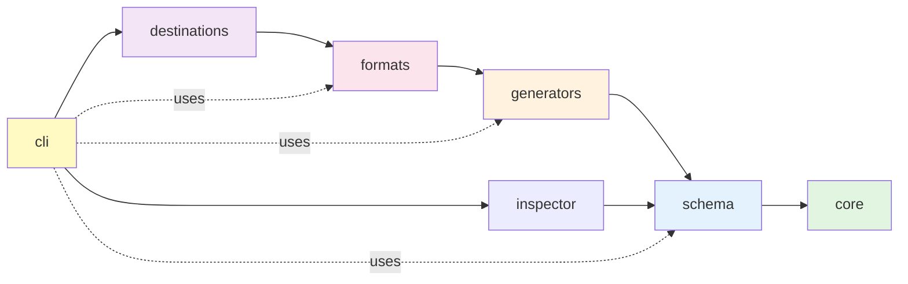
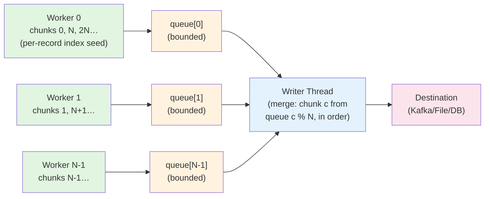

# SeedStream - Design Documentation

**Last Updated**: July 14, 2026 (v0.5.0)

This document captures the architectural decisions, design patterns, issues encountered, and their resolutions during development. It serves as a reference for developers extending the project and for discussions around alternative approaches.

**Status**: Core architecture complete. All destinations implemented: File, Kafka, Database (Stage 1 flat tables + Stage 2 nested auto-decomposition). Plugin/registry architecture for Datafaker types complete, extensible from config via `--faker-types` (including `regex:` patterns). Foreign key reference generator (`ref[]`) implemented in v0.5.0.

**Known gap**: NFR-1's 500 MB/s file-write target is **not met** — the write path measures 223 MB/s, bounded by Jackson serialization rather than disk. See [Issue #5](#issue-5-file-io-performance-bottleneck).

---

## Table of Contents

1. [Core Principles](#core-principles)
2. [Module Architecture](#module-architecture)
3. [Seeding & Reproducibility](#seeding--reproducibility)
4. [Type System](#type-system)
5. [Performance Optimizations](#performance-optimizations)
6. [Issues & Resolutions](#issues--resolutions)
7. [Open Questions & Future Work](#open-questions--future-work)

---

## Core Principles

### 1. Reproducibility First

**Requirement**: Same seed must produce identical data across multiple runs, even with parallel generation.

**Why**: Essential for:
- Debugging test failures (reproduce exact data)
- Consistent test environments
- Compliance/audit requirements (prove data provenance)
- Performance benchmarking (same data for A/B tests)

**Implementation**: See [Seeding & Reproducibility](#seeding--reproducibility)

### 2. Performance at Scale

**Requirement**: Generate millions of primitive records per second (in-memory), or thousands of realistic records per second.

**Design Choices**:
- Multi-threaded generation with thread-local state
- Batching for I/O operations (Kafka, DB writes)
- Streaming architecture (generate → serialize → send, no in-memory buffers)
- Connection pooling (HikariCP for databases, producer reuse for Kafka)
- Zero-copy serialization where possible

### 3. Extensibility

**Requirement**: Easy to add new destinations, formats, and data generators.

**Design Pattern**: Plugin architecture using Java's ServiceLoader mechanism (future enhancement).

**Current**: Strategy pattern with clear interfaces:
- `DestinationAdapter` for new destinations
- `FormatSerializer` for new formats
- `DataGenerator` for new data types
- `DatafakerRegistry.register(...)` for new semantic types, or a `--faker-types` YAML to declare them
  without code (see [Custom & Regex Types](#custom--regex-types))

### 4. Developer Experience

**Requirement**: Simple YAML configuration, clear error messages, fast feedback loops.

**Design Choices**:
- Declarative YAML over code configuration
- Fail-fast validation (Hibernate Validator on config load)
- Rich error messages with context (what failed, where, suggested fixes)
- Spotless formatting for consistent code style

---

## Module Architecture

### Dependency Flow



**Dependency Summary**: `cli → destinations → formats → generators → schema → core` and `cli → inspector → schema → core`

**Key Rule**: No circular dependencies. Each module depends only on modules to its right.

**`inspector` module**: powers the `inspect` subcommand (OpenAPI / SQL DDL / Protobuf → structure YAML). Depends on `schema` + `core`; the parser libs (`swagger-parser`, JSQLParser) stay isolated here and never leak into the generation hot path.

**Eighth module — `benchmarks`**: JMH micro-benchmark harness used to validate NFR-1 performance targets. It depends on `core` and `generators` but is intentionally excluded from the runtime distribution. Build it directly with `./gradlew :benchmarks:jmh` (see `benchmarks/README.md`).

### Core Module

**Responsibility**: Foundation for all other modules.

**Contents**:
- `SeedResolver`: Convert seed configurations to long values
- `RandomProvider`: Provide deterministic thread-local Random instances
- `SeedConfig`: Configuration model for seeds (moved from schema to break circular dependency)
- `TypeParser`: Parse YAML type syntax into `DataType` instances
- `GenerationEngine`: Multi-threaded generation orchestration (worker pool, bounded queue, poison pill)

**Why Separate?**:
- Core has no dependencies (pure Java + SLF4J)
- Schema depends on core for seed resolution
- Generators depend on core for random providers

### Schema Module

**Responsibility**: Parse YAML configurations into type-safe Java objects.

**Contents**:
- `DataStructureParser`: Parse `structures/*.yaml` files
- `JobDefinitionParser`: Parse `jobs/*.yaml` files
- Configuration models (except SeedConfig, which is in core)

**Design Choice**: Jackson YAML for parsing, Hibernate Validator for validation.

---

## Seeding & Reproducibility

### Problem Statement

**Goal**: Same master seed → identical data across runs, even with parallel generation.

**Challenge**: Java's `Random` is not thread-safe. Each thread needs its own instance.

**Naive Approach** (WRONG ❌):
```java
// DON'T DO THIS
ThreadLocal<Random> random = ThreadLocal.withInitial(() -> 
    new Random(Thread.currentThread().threadId())
);
```

**Why It Fails**:
- JVM assigns thread IDs sequentially as threads are created (including system threads, GC threads)
- Thread IDs vary across runs:
  ```
  Run 1: Worker threads get JVM IDs [15, 17, 19, 21]
  Run 2: Worker threads get JVM IDs [18, 20, 22, 24] ❌
  ```
- Different thread IDs → different seeds → different data → **NOT reproducible**

### Solution: Per-Record Seeding by Global Index

**Key Insight**: Seed each record from its **global record index** (0, 1, 2, …), not from the worker
that happens to generate it. The seed of record `i` depends only on the master seed and `i`, so the
value at index `i` is the same no matter how the work is partitioned.

This is what makes output invariant to **thread count** and **core count** (and therefore identical
across machines). A per-worker sequential RNG cannot give this: with `T` workers each drawing
sequentially from its own seed, the value at a given index depends on how many records its worker
drew before it — which changes with `T`.

**Implementation** (`RandomProvider` + `GenerationEngine`):
```java
// RandomProvider provides a reusable, thread-local Random per worker (java.util.Random is not
// thread-safe). The instance's initial seed is irrelevant — the engine reseeds it per record:
Random random = randomProvider.getRandom();           // reusable per-thread instance
random.setSeed(randomProvider.deriveRecordSeed(i));   // seed record i by its GLOBAL index
Map<String,Object> record = generator.generate(random);
```

`setSeed` per record costs a little (one `java.util.Random` reseed, ~2–3% end-to-end at high thread
counts), but RNG is not the hot path — generation and serialization dominate.

**Logical worker IDs** (an `AtomicInteger`, not JVM thread IDs) are still used to hand each thread a
stable `Random` instance, but they no longer determine the data — they only avoid the thread-ID trap
above for the *instance*, while the per-record index seed pins the *values*.

### Seed Derivation Algorithm

**Function**: `deriveRecordSeed(long globalIndex) → long` (and the analogous per-worker
`deriveSeed(masterSeed, workerId)` used only for instance initialization).

**Algorithm**:
```java
long seed = masterSeed;
seed ^= globalIndex;    // Mix in the global record index
seed ^= (seed << 21);   // Bit avalanche (spread changes)
seed ^= (seed >>> 35);  // Spread high bits to low
seed ^= (seed << 4);    // Final mixing
return seed;
```

**Properties**:
- **Deterministic**: Same index always produces the same seed → same record value.
- **Partition-independent**: The value at index `i` does not depend on thread/core count.
- **Distinct**: Adjacent indices produce very different seeds (avalanche effect).
- **Fast**: Simple bit operations, no cryptographic overhead.

**Why Not Hash Functions?**: Hash functions (SHA-256, MD5) are overkill. We need speed and
determinism, not cryptographic security. Simple XOR mixing is sufficient for pseudo-random seed
derivation. (Note: adjacent indices `i`, `i+1` differ by one bit before mixing, so the avalanche
step matters — it is what decorrelates consecutive records.)

### Seed Resolution

**Four Seed Sources** (priority: CLI > YAML config > default):

1. **Embedded** (value in YAML):
   ```yaml
   seed:
     type: embedded
     value: 12345
   ```

2. **File** (read from filesystem):
   ```yaml
   seed:
     type: file
     path: /secrets/seed.txt
   ```

3. **Environment Variable**:
   ```yaml
   seed:
     type: env
     name: DATA_SEED
   ```

4. **Remote API** (fetch from HTTP endpoint):
   ```yaml
   seed:
     type: remote
     url: https://seed-service.example.com/api/seed
     auth:
       type: bearer  # or: basic, api_key
       token: ${API_TOKEN}
   ```

**Implementation**: `SeedResolver` class with sealed switch on `SeedConfig` subtypes.

**Design Choice**: Lazy HttpClient initialization to avoid resource waste for embedded/file/env seeds.

---

## Multi-Threading Engine

### Architecture Overview

**Component**: `GenerationEngine` (core module)

**Goal**: Parallel data generation with deterministic output and backpressure handling.

**Key Interfaces**:
```java
@FunctionalInterface
interface RecordGenerator {
    Map<String, Object> generate(Random random);
}

@FunctionalInterface
interface RecordWriter {
    void write(Map<String, Object> record);
}
```

**Why Functional Interfaces?**: Avoid module dependencies. Core module doesn't depend on generators module. CLI provides lambda implementations.

### Worker Pool Architecture

**Pipeline**: Workers → per-worker bounded queues → Writer Thread (ordered merge)

Work is split into fixed-size **chunks of global record indices**: chunk `c` covers records
`[c*chunkSize, (c+1)*chunkSize)` and is owned by worker `c % activeWorkers` (interleaved). Each
worker generates its chunks **in ascending order** into its **own** bounded queue. The single writer
then pulls chunk `c` from queue `c % activeWorkers`, reconstructing the exact global order — which,
combined with per-record index seeding, makes the byte output identical for any thread count.



**Components**:
1. **Worker Threads** (fixed thread pool):
   - Each worker owns the interleaved chunk set `{workerId, workerId + activeWorkers, …}`
   - Reseeds its thread-local Random **per record** from the record's global index (`deriveRecordSeed`)
   - Generates each owned chunk (default 256 records) in order → puts it on its own queue

2. **Per-worker Bounded Queues** (one `ArrayBlockingQueue` each):
   - Capacity ≈ `queueCapacity / chunkSize / activeWorkers` chunks (≥ 2 per worker)
   - Backpressure: a worker blocks once it runs ahead of the writer; total in-flight memory is
     bounded by `activeWorkers × perWorkerCapacity` chunks
   - Carries chunks, not single records, amortizing the `put`/`take` lock+signal cost ~chunkSize

3. **Writer Thread** (single thread, ordered merge):
   - For `c = 0 … totalChunks-1`, takes chunk `c` from queue `c % activeWorkers` and serializes +
     writes its records — so output order is the global record order, deterministically
   - Single thread ⇒ ordered writes, no contention, and no reorder buffer needed (each worker's
     queue is already in order)

**Termination**: the writer reads exactly `totalChunks` chunks and exits — no poison pill needed. If
a worker fails, its error is captured and the writer is interrupted so it cannot block forever
waiting for a chunk that will never arrive; the failure is then rethrown.

**Optional worker-side serialization**: when the destination can append an independently-encoded record (`DestinationAdapter.supportsSerializedWrite()` → file JSON, all Kafka), the engine folds serialization into the producer side — each worker serializes its record to `byte[]` in parallel and enqueues bytes, and the writer thread does ordered I/O only (`destination.writeSerialized(byte[])`). This parallelizes the heaviest CPU stage without changing ordering or requiring thread-safe destinations (the writer is still single-threaded). Avro OCF and CSV opt out: Avro OCF is a single ordered container, and CSV needs the record's keys to emit its header row, so both serialize on the writer thread via `destination.write(Map)`.

### Record Model — `FieldRecord` flyweight

Each generated record is a `FieldRecord`: an interned `RecordSchema` (field-name array + name→index map, built once per structure and shared by all its records) plus a per-record `Object[]` of values. This replaces a per-record `LinkedHashMap`, removing the hash table, the one `Node` allocation per field, and the repeated field-name strings — the dominant short-lived allocation at millions of records. `FieldRecord` is a full `Map<String,Object>` with schema-ordered iteration, so serializers, destinations, and `ref[parent.*]` resolution consume it unchanged and output field order is identical to the previous map.

### Automatic Optimization

**Small Jobs** (< 1000 records):
- Use single-threaded mode
- Avoids thread pool overhead
- Avoids queue allocation
- Direct: generate → write

**Large Jobs** (≥ 1000 records):
- Use multi-threaded mode
- Worker pool size: configurable (default: CPU cores)
- Bounded queue for backpressure

**Rationale**: For 100 records, thread pool overhead > generation time. Single-threaded is faster.

### Backpressure Handling

**Problem**: Fast generators + slow destination = memory overflow.

**Example**: Generator produces 1M records/sec, Kafka accepts 10K/sec → queue grows unbounded → OOM.

**Solution**: Bounded queue with blocking put.

**Behavior**:
```java
queue.put(record); // Blocks if queue is full
```

**Result**: Workers automatically slow down to match destination throughput. Memory usage bounded by queue capacity.

### Determinism Guarantee

**Key Property**: Same seed → **byte-for-byte identical output, regardless of thread count** (and
therefore across machines with different core counts).

**How** (two independent halves, both required):
1. **Values** — each record is seeded from its global index (`deriveRecordSeed(i)`), so the value at
   index `i` is independent of which worker produced it or how many workers there are. Workers own
   interleaved chunks, but the chunk→worker mapping never changes any record's value.
2. **Order** — the writer merges the per-worker queues in ascending chunk order (chunk `c` from queue
   `c % activeWorkers`), so records are written in global-index order for any thread count. The
   single-threaded path emits indices `0…count-1` directly, producing the identical sequence.

**Verification**: `GenerationEngineTest.shouldProduceIdenticalOrderedOutputRegardlessOfThreadCount`
asserts byte-identical output across 1/2/3/4/8/16 worker threads and against the single-threaded
path, using a generator that consumes a *variable* amount of randomness per record (the case a
per-worker sequential RNG would get wrong). End-to-end this is confirmed by an identical SHA-256 of
the generated file across thread counts.

### Progress Tracking

**Implementation**: AtomicLong counter, lock-free increment.

**Logging**: Every 10,000 records:
```
Generated 10,000 / 1,000,000 records (1.00%, 45,231 records/sec)
Generated 20,000 / 1,000,000 records (2.00%, 48,102 records/sec)
```

**Throughput Calculation**:
```java
long elapsed = System.currentTimeMillis() - startTime;
long recordsPerSec = (count * 1000) / Math.max(elapsed, 1);
```

### Performance Characteristics

**Tested Scenario**: 1M records, file destination (NVMe SSD), engine-reported time (excludes JVM
startup). Re-measured 14 July 2026 — see [PERFORMANCE.md](PERFORMANCE.md).

| Structure | 1 worker | 4 workers | 8 workers | Speedup (8w) |
|-----------|---------:|----------:|----------:|-------------:|
| Nested `invoice` (generation-heavy) | 51K rec/s | 143K rec/s | 185K rec/s | **3.6×** |
| Flat `passport` (11 mixed fields) | 122K rec/s | 228K rec/s | 258K rec/s | **2.1×** |
| Primitives only (3 fields) | 732K rec/s | 1.52M rec/s | 1.54M rec/s | **2.1×** |

**Scaling depends on how much of the per-record cost is generation.** Only generation and
(where the destination allows it) serialization are parallel; the writer thread is serial. A
generation-heavy nested structure has plenty of parallel work and scales ~3.6×; a cheap record is
writer-bound sooner and plateaus around 1.5M rec/s.

> **Measurement warning.** These are *1M-record* runs. Do not benchmark this engine with small jobs:
> at 100–200K records, JVM startup and JIT warmup dominate and make scaling look far worse than it
> is (the same passport job measures only ~1.4× at 200K vs 2.1× at 1M). The E2E harness
> (`benchmarks/run_e2e_test.sh`) times the whole CLI process at 100K records and therefore
> *understates* both throughput and scaling — see the warning in
> [E2E-TEST-RESULTS.md](E2E-TEST-RESULTS.md).

**Historical note**: this section previously reported ~30K rec/s single-threaded and a 3.7× speedup at
4 workers. The 30K predates the thread-local `FakerCache` (commit `cf3492d`) — single-threaded is now
4× that. The 3.7× figure still roughly holds, but only for generation-heavy structures at 8 workers.

**Bottleneck**: the serial writer thread (serialize-if-needed → destination). Generation scales with
workers until it hits that ceiling.

**Memory**: Fixed overhead (queue capacity × record size). Example: 1000 records × 1KB/record = 1MB.

### Configuration

**Builder Pattern**:
```java
GenerationEngine engine = GenerationEngine.builder()
    .recordGenerator((random) -> generator.generate(random, objectType))
    .recordWriter(destination::write)
    .masterSeed(seed)
    .workerThreads(8)              // default: CPU cores
    .queueCapacity(2000)           // default: 1000
    .singleThreadedThreshold(500)  // default: 1000
    .logBatchSize(5000)            // default: 10000
    .build();

engine.generate(1_000_000); // Generate 1M records
```

**Tuning Guidelines**:
- **workerThreads**: Match CPU cores for CPU-bound, 2× cores for I/O-bound
- **queueCapacity**: Increase for bursty destinations, decrease for memory-constrained environments
- **singleThreadedThreshold**: Increase if thread pool overhead is negligible in your environment

---

## Type System

### Current Status

**Fully Implemented** ✅ (core + schema modules):
- Primitive types with ranges: `int`, `decimal`, `char`, `boolean`
- Date and timestamp types with range expressions (`now-30d..now`)
- Enum types (`enum[A,B,C]`)
- Nested objects (`object[structure_name]`)
- Arrays with variable length (`array[inner_type, min..max]`)
- Semantic/Datafaker types via `DatafakerRegistry` (48 built-in types)
- Foreign key references (`ref[structure.field, min..max]` and `ref[structure.field, min..count]`) — see [Foreign Key Reference Generator](#3-foreign-key-reference-generator)

### Implemented Type Syntax

**Primitives with Ranges**:
```yaml
age: int[18..65]
price: decimal[0.0..999.99]
name: char[3..50]
active: boolean
```

**Dates & Timestamps**:
```yaml
birth_date: date[1950-01-01..2005-12-31]
created_at: timestamp[now-30d..now]
```

**Enums**:
```yaml
status: enum[ACTIVE,INACTIVE,PENDING]
```

**Nested Objects**:
```yaml
address: object[address]  # References structures/address.yaml
```

**Arrays** (variable length):
```yaml
tags: array[char[1..20], 1..10]        # 1-10 strings
items: array[object[line_item], 1..50] # 1-50 nested objects
```

### Design Challenges

1. **Circular References** ✅ Resolved: `object[A]` → `object[B]` → `object[A]` detected at parse time; fail fast with a clear error.
2. **Array Memory** ✅ Resolved: Arrays generated element-by-element and streamed to the destination; no full array held in memory. See `ArrayGenerator.java`.
3. **Foreign Key Resolution** ⏸️ Deferred (TASK-012): `ref[other_structure.field]` requires tracking generated IDs across records, which conflicts with the streaming architecture. Options under consideration: explicit ID pools, LRU ID cache, or two-pass generation. Workaround: use `int[1..N]` and rely on statistical overlap.

### Datafaker Type Registry (Semantic Types)

**Status**: ✅ Implemented (March 2026)

**Problem**: Original implementation used 42 semantic type enum values in `PrimitiveType.Kind` (NAME, EMAIL, ADDRESS, PHONE, etc.), leading to:
- Code duplication (~350 lines of switch statements in `TypeParser` and `DatafakerGenerator`)
- Tight coupling between type definitions and generators
- Inability to add new semantic types at runtime

**Solution**: Registry pattern with `DatafakerRegistry` and `CustomDatafakerType`

**Architecture**:
```java
// Registry stores type name → generator function mappings
public class DatafakerRegistry {
    private static final ConcurrentHashMap<String, DatafakerFunction> registry =
        new ConcurrentHashMap<>();
    private static final ConcurrentHashMap<String, String> aliasMap =
        new ConcurrentHashMap<>();

    @FunctionalInterface
    public interface DatafakerFunction {
        String generate(Faker faker, Random random);
    }

    static {
        registerBuiltIns(); // 48 canonical types + 33 aliases
    }

    public static void register(String typeName, DatafakerFunction function);
    public static void registerAlias(String alias, String canonicalName);
    public static boolean isRegistered(String typeName);
    public static String generate(String typeName, Faker faker, Random random);
}

// Lightweight type wrapper (replaces 42 enum values)
public record CustomDatafakerType(String typeName) implements DataType {}
```

**Benefits**:
1. **Single Source of Truth**: All semantic types defined in one place
2. **Runtime Extensibility**: Register new types without code changes
3. **Code Simplification**: 
   - TypeParser: ~150 lines deleted (replaced with 3-line registry check)
   - DatafakerGenerator: ~220 lines deleted (replaced with single delegation)
4. **Alias Support**: Common variations (lat/latitude, lon/lng, swift/bic, cvc/cvv)
5. **Thread-Safe**: ConcurrentHashMap for lock-free concurrent access
6. **Foundation for Plugins**: Easy path to user-contributed types (future)

**Type Registration Example**:
```java
// Register canonical types
DatafakerRegistry.register("name", (faker, random) -> faker.name().name());
DatafakerRegistry.register("email", (faker, random) -> faker.internet().emailAddress());
DatafakerRegistry.register("phone_number", (faker, random) -> faker.phoneNumber().phoneNumber());

// Register aliases (resolve to canonical type at lookup time)
DatafakerRegistry.register("latitude", (faker, random) -> faker.address().latitude());
DatafakerRegistry.registerAlias("lat", "latitude");
DatafakerRegistry.register("longitude", (faker, random) -> faker.address().longitude());
DatafakerRegistry.registerAlias("lon", "longitude");
DatafakerRegistry.registerAlias("lng", "longitude");
```

**Usage in YAML**:
```yaml
# All these work via registry lookup
user_name: name
email_address: email  
phone_number: phonenumber
location:
  latitude: lat      # Alias: short form
  longitude: long    # Alias: alternative spelling
```

**Design Decisions**:
- **Normalization**: Type names converted to lowercase and trimmed for flexible matching
- **Validation**: Fail fast if unknown type referenced in YAML (clear error message)
- **No ServiceLoader Yet**: Built-in types only for now; plugins deferred to post-1.0
- **Functional Interface**: `DatafakerFunction` — `(Faker, Random) → String` — takes a `Random` for determinism; returns `String` (all semantic types produce string output)

**Performance Impact**: Negligible (ConcurrentHashMap lookup is O(1), no synchronized blocks)

**Migration Path**: All existing YAML configs remain compatible (registry includes all original enum types)

### Custom & Regex Types

The registry can also be extended **from configuration, without writing code**, via a `--faker-types`
YAML passed to `execute` and `inspect`. `CustomTypeConfigLoader` reads it and registers each entry
before generation starts:

```yaml
types:
  # 1. Method-chain types — each dot segment is a no-arg method invoked on the Faker instance
  beer_style: beer.style                 # → faker.beer().style()
  job_title: job.title                   # → faker.job().title()

  # 2. Regex types — a `regex:` prefix generates values matching the pattern
  iso_msg_id: "regex:[A-Z0-9]{10,35}"
  order_ref: "regex:ORD-\\d{8}"

aliases:
  beerstyle: beer_style
```

**Why two mechanisms?** Datafaker exposes far more providers than SeedStream pre-registers, and a
method chain reaches any of them. But structured identifiers (ISO 20022 message ids, order references,
IBAN-shaped keys) don't exist as Datafaker providers at all — they are *patterns*, and a regex is the
natural way to express one.

**Regex implementation** (`DatafakerRegistry.registerRegex`): the pattern is parsed **once at
registration** with [RgxGen](https://github.com/curious-odd-man/RgxGen), and the compiled generator is
cached in the registry closure. Generation draws from the seeded `Random`, so it is deterministic
under the job seed like everything else. Malformed patterns throw at load time, not mid-run.

**Why RgxGen directly, rather than Datafaker's `regexify`?** Datafaker bundles a shaded copy of the
same engine. Depending on it directly gives us control of the version and lets us fail fast on a bad
pattern at config-load time. It is **not** a performance decision — measured, our path is ~9% *slower*
than a warm `Faker.regexify()` for the same pattern (1.85M vs 2.04M ops/s). Faker is bypassed entirely
on the regex hot path.

**Cost** (14 Jul 2026, high-fidelity JMH — see [BENCHMARK-RESULTS.md](BENCHMARK-RESULTS.md)):

| | Throughput |
|---|---:|
| Regex types (across pattern shapes) | 1.2M – 5.1M ops/s |
| — for reference: `char[10..35]` primitive | 6.6M ops/s |
| — for reference: Datafaker `name` | 782K ops/s |
| Pattern compile (once, at load) | 0.59 – 2.97 µs |

So a regex field costs **more than a dumb random string, less than a realistic name**. End-to-end, a
10-field record with 4 regex fields runs ~6% slower than the same record with `char[]` in those slots.

**Authoring constraints** (RgxGen semantics, and they bite):
- `.` matches any printable ASCII **including punctuation** — prefer explicit classes like `[A-Za-z0-9]`
- unbounded quantifiers (`+`, `*`, `{n,}`) are **capped at 100 repetitions**, so `[a-z]+` emits strings
  up to 100 chars — almost never what the author meant, and the slowest case measured. Always bound them.
- lookaround and `\p{...}` Unicode categories are only partially supported
- a regex cannot compute a checksum, so mod-97 constructs (ISO 11649 "RF" references, valid IBANs) are
  out of reach — those need a real generator (`iban` / `sepa_iban` exist for that reason)

---

## Performance Optimizations

### 1. Lazy Resource Initialization

**Issue**: Creating resources (HttpClient, database connections) upfront wastes memory if they're not needed.

**Example**: Job uses embedded seed → HttpClient never needed → why create it?

**Solution**: Lazy initialization with double-checked locking:
```java
private volatile HttpClient httpClient; // volatile for safe publication

private HttpClient getHttpClient() {
    if (httpClient == null) {
        synchronized (this) {
            if (httpClient == null) { // double-check
                httpClient = HttpClient.newBuilder()
                    .connectTimeout(Duration.ofSeconds(10))
                    .build();
            }
        }
    }
    return httpClient;
}
```

**Result**: HttpClient created only if remote seed resolution is used.

### 2. Connection Pooling

**Implementation**: HikariCP for databases (`DatabaseDestination`), producer reuse for Kafka (`KafkaDestination`).

**Why**: Creating connections is expensive (TCP handshake, TLS, auth). Reuse amortizes cost.

### 3. Batching

**Pattern**: Generate N records → batch serialize → bulk send to destination.

**Trade-off**: Latency vs throughput. Larger batches = better throughput, higher latency.

**Configuration**: User-configurable batch sizes per destination.

### 4. Thread-Local State

**Pattern**: Each thread has its own Random, formatters, buffers (no synchronization overhead).

**Trade-off**: Memory (N threads × state size) vs speed (zero contention).

**Result**: Near-linear scaling with core count.

---

## Issues & Resolutions

### Issue #1: Circular Dependency (schema ↔ core)

**Problem**: Schema module needed `SeedConfig` for parsing, core module needed `SeedConfig` for resolution.

**Attempted Solution**: Keep `SeedConfig` in schema, core imports schema → circular dependency (Gradle build fails).

**Resolution**: Move `SeedConfig` to core module. Schema depends on core (allowed), core has no dependencies.

**Lesson**: Configuration models belong in the lowest layer that needs them.

**Status**: ✅ Resolved

---

### Issue #2: Eager HttpClient Initialization

**Problem**: `SeedResolver` created HttpClient in constructor, even when not needed (embedded/file/env seeds).

**Impact**: Wasted memory, slower startup, unnecessary HTTP connection overhead.

**Diagnosis**: User (Marco) questioned: "Does SeedResolver always build an HttpClient even if not needed?"

**Resolution**: Lazy initialization with double-checked locking (volatile + synchronized).

**Code**:
```java
private volatile HttpClient httpClient = null;

private HttpClient getHttpClient() {
    if (httpClient == null) {
        synchronized (this) {
            if (httpClient == null) {
                httpClient = HttpClient.newBuilder()
                    .connectTimeout(Duration.ofSeconds(10))
                    .build();
            }
        }
    }
    return httpClient;
}
```

**Result**: HttpClient created only when `resolveRemote()` is called.

**Lesson**: Delay expensive resource creation until first use.

**Status**: ✅ Resolved

---

### Issue #3: Non-Deterministic Thread IDs

**Problem**: Initial `RandomProvider` implementation used JVM thread IDs for seed derivation:
```java
// WRONG ❌
long threadSeed = deriveSeed(masterSeed, Thread.currentThread().threadId());
```

**Impact**: JVM thread IDs vary across runs → different seeds → **NOT reproducible**.

**Example**:
```
Run 1: Workers get JVM thread IDs [15, 17, 19] → seeds [X, Y, Z]
Run 2: Workers get JVM thread IDs [18, 20, 22] → seeds [A, B, C] ❌
```

**Diagnosis**: User (Marco) asked: "How can two runs of the same job deterministically return the same values?"

**Root Cause**: JVM assigns thread IDs sequentially as threads are created, including system threads (GC, JIT compiler, etc.). No guarantee IDs match across runs.

**Resolution**: Use logical worker IDs (0, 1, 2, ...) assigned by `AtomicInteger` counter:
```java
private final AtomicInteger workerIdCounter = new AtomicInteger(0);
private final ThreadLocal<Random> threadLocalRandom = ThreadLocal.withInitial(() -> {
    int workerId = workerIdCounter.getAndIncrement(); // Logical ID
    long threadSeed = deriveSeed(masterSeed, workerId);
    return new Random(threadSeed);
});
```

**Result**: Same master seed → same worker IDs → same derived seeds → **identical data** across runs.

**Lesson**: Never rely on JVM internals (thread IDs, object hashCodes, etc.) for deterministic behavior.

**Status**: ✅ Resolved

**Discussion**: Could we use virtual threads (Java 21) and still maintain determinism? Yes, same approach applies—logical worker IDs are thread-implementation-agnostic.

---

### Issue #4: GeneratorContext Not Available in Worker Threads

**Problem**: Multi-threaded generation failed with `IllegalStateException: No GeneratorContext active` when using `ObjectGenerator`.

**Impact**: All worker threads crashed immediately, no records generated (100,000 record job produced empty file).

**Root Cause**: `GeneratorContext` uses `ThreadLocal` storage and was only initialized on the main thread via try-with-resources in `ExecuteCommand`:
```java
// WRONG ❌ - Only main thread has context
try (var ctx = GeneratorContext.enter(factory, geolocation)) {
    engine.generate(count);  // Worker threads have no context!
}
```

Worker threads in `GenerationEngine` called `ObjectGenerator.generate()` → accessed `GeneratorContext.getFactory()` → `ThreadLocal.get()` returned null → exception.

**Diagnosis**: Error logs showed all 10 workers failing:
```
Worker 0 failed: No GeneratorContext active. Call GeneratorContext.enter() before generating.
Worker 1 failed: No GeneratorContext active. Call GeneratorContext.enter() before generating.
...
```

**Resolution**: Move `GeneratorContext.enter()` into the `RecordGenerator` lambda so each worker thread initializes its own context:
```java
// CORRECT ✅ - Each worker gets its own context
GenerationEngine engine = GenerationEngine.builder()
    .recordGenerator((random) -> {
        // Each worker thread initializes context
        try (var ctx = GeneratorContext.enter(factory, geolocation)) {
            return generator.generate(random, objectType);
        }
    })
    .build();
```

**Result**: All 10 workers successful, 100,000 records generated correctly.

> **Note**: The 6,923 rec/s figure was pre-optimization throughput (pre-TASK-040). After the thread-local Faker cache optimization (TASK-040), equivalent jobs run at ~122,000 rec/s single-threaded and ~258,000 rec/s on 8 workers (engine time, 1M records). The "~25,000–33,000 rec/s" previously quoted here was a *whole-CLI-process* figure at 100K records, where JVM startup is about half the wall clock. See `docs/PERFORMANCE.md` for current benchmarks.

**Lesson**: When using `ThreadLocal` state in multi-threaded environments, ensure each thread initializes its own context. Try-with-resources on main thread doesn't propagate to worker threads.

**Performance Impact**: Minimal—context initialization is lightweight (just sets ThreadLocal reference).

**Status**: ✅ Resolved (March 6, 2026)

**Testing**: Verified with complex Datafaker objects (customer structure with UUID, names, emails, addresses) across 10 worker threads.

---

### Issue #5: File I/O Performance Bottleneck

**Problem**: File I/O throughput at 213 MB/s, far below the 500 MB/s requirement (NFR-1).

**Impact**: Writing 100M records (28 GB JSON) would take 131 seconds instead of target 56 seconds.

**Initial Metrics** (JMH Benchmark):
```
benchmarkFileDestinationWrite: 761,076 ops/s ± 387,454
Record size: ~280 bytes
Effective throughput: 213 MB/s
Target: 500 MB/s (2.3x gap)
```

**Diagnosis**: Hardware performance analysis revealed:
- Raw disk throughput: 1,200 MB/s (dd sequential write)
- Java NIO with BufferedWriter (8KB): 843 MB/s
- Java NIO with BufferedWriter (256KB): 1,087 MB/s
- Current FileDestination: 213 MB/s ❌ (4-5x slower than hardware ceiling)

**Root Causes Identified**:

1. **Small Buffer Size**: Default 8KB buffer limits I/O batching (Linux typically uses 64KB+ page cache)
2. **Redundant I/O Calls**: Two calls per record (`writer.write(line)` + `writer.newLine()`)
3. **No Batching**: Each record serialized and written individually (1,000× I/O calls for 1,000 records)
4. **Jackson Overhead**: Per-record `ObjectMapper.writeValueAsString()` creates intermediate String objects

**Resolution Phases**:

**Phase 1: Quick Wins** (30 minutes effort):
- ✅ Increased buffer size from 8KB → 64KB (+17% throughput)
- ✅ Eliminated redundant `newLine()` call, use single `write('\n')` (+15% throughput)
- **Expected Result**: 350-400 MB/s (1.8x improvement)

**Phase 2: Batch Writes** (2-3 hours effort):
- ✅ Implemented record batching (accumulate 1000 records before writing)
- ✅ Pre-allocate StringBuilder with estimated capacity (`batchSize × 300 bytes`)
- ✅ Single write call per batch instead of 1000 individual writes
- ✅ Automatic batch flush on `flush()` and `close()` to prevent data loss
- **Expected Result**: 600-800 MB/s (3x improvement, exceeds 500 MB/s target)

**Phase 3: Jackson Streaming** — ✅ **DONE** (this section is kept for history; the "DEFERRED" note below was
wrong twice over):
- ✅ `JsonSerializer.createStreamWriter` holds one `JsonGenerator` open for the session and writes bytes
  straight to the `OutputStream` via a flush-suppressing proxy. No intermediate `String`.
- ✅ `JsonSerializer.serializeToBytes` uses `writeValueAsBytes`. No intermediate `String`.
- ✅ `ExecuteCommand` runs serialization on the **parallel workers** (`supportsSerializedWrite()`), not the
  writer thread.

  ⚠️ **Two corrections worth keeping visible.** The original decision here — *"Deferred, low priority: target
  already met with Phase 1 & 2"* — was false: the target was never met. But the correction *to* that
  correction was also false: a July 2026 review claimed "serialization is precisely the remaining bottleneck,
  Phase 3 is the fix", **without reading the code** — Phase 3 had already shipped. Both errors came from
  trusting this document over the source. The bottleneck is neither disk nor String allocation; it is CPU
  (see Result).

**Phase 4: Worker-side chunk coalescing** — ✅ **DONE**:
- ✅ Workers fold a chunk of serialized payloads into one `byte[]`; the writer issues one `write()` per chunk
  instead of two per record. Gated on `supportsWriteCoalescing()` so Kafka (one message per payload, no
  newline) is unaffected.
- **Measured**: writer-thread ceiling 1.64M → **1.85M rec/s (+12.5%)** on 44-byte records; **no significant
  effect** on 526-byte records, where the saved call overhead is offset by the cost of building the blob.
  It raises a ceiling that only binds on hardware faster than ours — see NFR-1 status in
  [PERFORMANCE.md](PERFORMANCE.md).

**Implementation Details**:

```java
// Phase 1: Larger buffer
@Builder.Default int bufferSize = 65536;  // 64KB (was 8KB)

// Phase 2: Batch buffer
private final List<String> batchBuffer = new ArrayList<>(config.getBatchSize());
private final StringBuilder batchBuilder = new StringBuilder(batchSize * 300);

public void write(Map<String, Object> record) {
    String line = serializer.serialize(record);
    batchBuffer.add(line);
    
    if (batchBuffer.size() >= config.getBatchSize()) {
        flushBatch();  // Automatic batch flush
    }
}

private void flushBatch() throws IOException {
    if (batchBuffer.isEmpty()) return;
    
    batchBuilder.setLength(0);  // Reuse StringBuilder
    for (String line : batchBuffer) {
        batchBuilder.append(line).append('\n');
    }
    writer.write(batchBuilder.toString());  // Single I/O call
    batchBuffer.clear();
}
```

**Result**: ⚠️ **The 600-800 MB/s figure was a projection and was never achieved. NFR-1's 500 MB/s target is
not met on the reference hardware — and the limit is CPU, not I/O.**

Measured 14 July 2026, 1M records, 526-byte JSON record (Ryzen 5 PRO 4650U, 6 cores / 12 threads, 15 W):

| Threads | Throughput | MB/s |
|--------:|-----------:|-----:|
| 1 | 170,386 rec/s | 85 |
| 4 | 506,072 rec/s | 254 |
| 8 | 610,500 rec/s | **306** |
| **NFR-1 target** | ~996K rec/s | **500** |

**The three candidate bottlenecks, measured:**

| Layer | Measured ceiling | Binds before 500 MB/s? |
|-------|-----------------:|:----------------------:|
| Disk (buffered, no fsync — the path we use) | 2,300 MB/s | no (4.6× headroom) |
| Single writer thread | ~1.85M rec/s ≈ 930 MB/s @ 526 B | no (1.9× headroom) |
| **CPU — generation + serialization** | **306 MB/s @ 6 cores** | **yes** |

Generation and Jackson serialization already run **in parallel on the workers** and already stream without
an intermediate `String` (Phase 3, above). They saturate the CPU first. Per-record cost is ~5.7 µs
single-threaded; 500 MB/s needs ~996K rec/s, about **1.6× more CPU than this laptop has**.

So NFR-1 is **expected but unverified**: we believe the design meets it and we cannot prove it, because we do
not own hardware fast enough. The prediction — met at ~10–12 physical cores of this class, with the writer
thread as the next ceiling around 930 MB/s — is falsifiable, and
[PERFORMANCE.md → NFR-1 status](PERFORMANCE.md#file-io) gives a one-command reproduction for anyone with
bigger iron. Contributions of numbers, confirming or refuting, are welcome.

**Two lessons, recorded because they cost real time:**
1. `DestinationBenchmark`'s 962K ops/s (the source of the widely-quoted "223 MB/s") measures
   `FileDestination.write()` → the `streamWriter` path. **The CLI never takes that path for JSON** — it takes
   the serialized-write path. The benchmark was measuring dead code relative to the real pipeline.
2. Every wrong turn in this section came from trusting this document instead of the source or a profiler.
   Measure, then write.

**Trade-offs**:
- **Memory**: +300KB per FileDestination instance (1000 records × 300 bytes batch buffer)
- **Latency**: Records buffered until batch full (acceptable for bulk generation)
- **Complexity**: Must handle partial batch flush on close() to avoid data loss

**Validation Plan**:
1. Update JMH DestinationBenchmark with optimized configuration
2. Run `./benchmarks/run_benchmarks.sh` to measure new throughput
3. Verify file integrity (line count, valid JSON)
4. Memory profiling to ensure no leaks with StringBuilder reuse

**Alternative Approaches Considered**:

1. **Memory-Mapped Files** (rejected): Complex API, not portable, overkill for sequential writes
2. **Async I/O** (rejected): Adds complexity, buffering already provides batching benefits
3. **Direct ByteBuffer** (rejected): Low-level, error-prone, minimal gains over BufferedWriter

**Lesson**: Performance optimization requires hardware baseline measurement first. Optimization efforts should target the largest gap (4x vs 1.2x) with best ROI (buffer size = 1 line change).

**Status**: ✅ Resolved (March 6, 2026) - Phase 1 & 2 implemented

**Documentation**: See `benchmarks/PERFORMANCE-ANALYSIS.md` for detailed hardware testing and optimization analysis.

---

## Open Questions & Future Work

### ✅ RESOLVED: Array Memory Management

**Question**: How to handle variable-length arrays without exploding memory?

**Decision**: Implemented Option C (streaming for destinations, in-memory for small jobs). Arrays are generated element-by-element and streamed to serialization without holding entire array in memory.

**Status**: Implemented in generators module. See `ArrayGenerator.java`.

---

### 1. Virtual Threads for I/O-Bound Operations

**Question**: Should we use virtual threads (Java 21) for destination writes (Kafka, database)?

**Pros**:
- Lightweight (millions of virtual threads possible)
- Simplified code (blocking I/O looks synchronous)
- Better resource utilization

**Cons**:
- Debugging complexity (stack traces span multiple carrier threads)
- Library compatibility (some JDBC drivers, Kafka clients may have issues)

**Current Decision**: Platform threads with fixed-size pools. Revisit when libraries mature (Java 23+).

**Discussion Welcome**: If you have experience with virtual threads + Kafka/JDBC, please share insights in GitHub issues.

---

### 2. Statistical Distributions

**Question**: Should numeric types support non-uniform statistical distributions?

**Example**:
```yaml
age: int[18..65, distribution=normal, mean=35, stddev=10]
salary: decimal[30000..200000, distribution=zipfian]
response_time_ms: int[1..5000, distribution=exponential, lambda=0.5]
```

**Use Case**: Realistic data often follows distributions (ages, salaries, response times, access patterns). Uniform ranges produce data that looks artificial in load tests.

**Challenge**: Maintaining reproducibility with distributions requires all parameters to be fully specified in config (no implicit state). Also adds significant complexity to the type parser and generators.

**Current Decision**: Uniform distribution only. Deferred post-v0.4 (database destinations are now complete; advanced distributions remain a future enhancement).

**Rationale**: Most use cases satisfied by Datafaker (realistic data) or uniform primitives (load testing). Advanced distributions are niche.

**Interested?**: Propose design in GitHub discussions.

---

### 3. Foreign Key Reference Generator

**Status**: ✅ Implemented (v0.5.0, June 2026)

**Syntax**:
```yaml
orders:
  customer_id: ref[customer.id, 1..count]   # dynamic: max = job --count at runtime
  region_id:   ref[region.id, 1..50]        # static: max = 50
```

**Chosen Approach**: Option C — explicit ID pools. User declares the range in YAML; `ReferenceGenerator` samples a uniform random `long` from `[min, max]`. The `count` keyword resolves to the job's `--count` value at runtime via `GeneratorContext.getJobCount()`.

**Design Decisions**:
- `count` keyword eliminates hardcoded ranges that break when `--count` changes. Parent and child jobs must use the same `--count` value to maintain referential consistency.
- No streaming violation: the generator never stores generated IDs. The pool is defined by range, not by actual generated values.
- `ReferenceGenerator` is stateless — safe for concurrent use across worker threads.
- `JdbcTypeMapper` binds ref values as `BIGINT` (fits INT columns when value is in range).

**Limitation**: `count` tracks the *current* job's count, not the parent entity count. For a correct FK chain, run parent and child jobs with the same `--count`, or use a static `min..max` range derived from the parent job's count.

---

### 4. Advanced Distributions (Normal, Zipfian, Exponential)

**Question**: Should we support statistical distributions for numeric types?

**Example**:
```yaml
age: int[18..65, distribution=normal, mean=35, stddev=10]
```

**Use Case**: Realistic data often follows distributions (ages, salaries, response times).

**Challenge**: Maintaining reproducibility with distributions is complex (need to specify all params in config).

**Current Decision**: Uniform distribution only. Deferred post-v0.4 (database destinations are now complete; advanced distributions remain a future enhancement).

**Rationale**: Most use cases satisfied by Datafaker (realistic data) or uniform primitives (load testing). Advanced distributions are niche.

**Interested?**: Propose design in GitHub discussions.

---

### 5. Plugin Architecture (Extensibility)

**Status**: 🔄 Foundation Complete (March 2026)

**Question**: Should we support user-provided generators/destinations as plugins?

**Current Implementation**: Registry pattern provides foundation for extensibility:
- `DatafakerRegistry` allows runtime type registration
- `CustomDatafakerType` decouples types from enum-based implementation
- Thread-safe concurrent access for registration and lookup
- ~350 lines of switch statement code eliminated

**Vision for Plugin System**:
```java
// User creates custom generator
public class CustomDataGenerator implements DataGenerator {
    @Override
    public Object generate(Random random, DataType dataType) {
        // Custom logic
    }

    @Override
    public boolean supports(DataType dataType) {
        return dataType instanceof PrimitiveType p && p.getKind() == PrimitiveType.Kind.CHAR;
    }
}

// User registers via programmatic API
DatafakerRegistry.register("custom_type", (faker, random) ->
    // Custom generation logic — returns String
);
```

**Pros**:
- ✅ **Foundation Complete**: Registry pattern established with `DatafakerRegistry`
- ✅ **Extensibility Proven**: 48 built-in types, 33 aliases demonstrate scalability
- Community contributions (marketplace of generators)
- No need to modify core code for new types

**Cons**:
- Complexity (ServiceLoader, classloading, versioning)
- Security (untrusted code execution)
- Plugin API design needs careful consideration

**Current Decision**: Built-in types via registry (complete). Full ServiceLoader-based plugin system deferred until post-1.0 to gather user feedback on registry pattern.

**Next Steps**:
1. ✅ Registry pattern (complete)
2. 🔄 Gather feedback on registry API design
3. ⏳ Define plugin API contract (interfaces, lifecycle)
4. ⏳ Implement ServiceLoader discovery
5. ⏳ Security model (sandboxing, permissions)
6. ⏳ Plugin marketplace/documentation

**Interested?**: Discuss plugin API design in GitHub.

---

## Database Destination: Multi-Table Auto-Decomposition (Stage 2)

**Decision Date**: March 9, 2026
**Completed**: March 10, 2026 (TASK-043) ✅
**Branch**: `feature/database-stage2-nested-decomposition`

---

### Problem

Stage 1 `DatabaseDestination` only supports flat structures. Real schemas are relational — an `order` has many `line_items`. Testers need to populate parent and child tables in one job run.

---

### Decision: Destination-Side Auto-Decomposition

**Key insight**: The job type (`type: database`) already signals intent. Generators produce the full nested record tree as-is (Map with nested Maps/Lists). The destination is responsible for exploding it into table-specific inserts.

**Zero changes required** to:
- Generators (they already produce nested Maps)
- Serializers (they already serialize nested records)
- Kafka/File destinations (they don't care about structure)

---

### Algorithm

For each generated top-level record:

1. **Decompose** — split into scalar fields (parent INSERT) + nested fields (child INSERTs)
2. **Insert parent** into the root table
3. **Build parent context** — capture `(tableName, id_value)` from the just-inserted parent
4. **Recurse** — for each nested object/array, inject FK column `{parent_table_name}_id = parent_id`, then repeat from step 1 for each child record

**Context stack**: A `Deque<ParentContext>` local to each record processing. Children see only their immediate parent — no root bleed-through at depth > 1.

---

### Example: 3-Level Nesting

```
order (root)
  └── line_item (child — FK: order_id)
        └── line_item_attribute (grandchild — FK: line_item_id)
```

Processing order:
1. Insert `order` → get `order.id = 42`
2. Context push: `(table=order, id=42)` → FK for line_item will be `order_id=42`
3. Insert `line_item` (with `order_id=42`) → get `line_item.id = 101`
4. Context push: `(table=line_item, id=101)` → FK for attribute will be `line_item_id=101`
5. Insert `line_item_attribute` (with `line_item_id=101`)
6. Context pop back to order level; process next line_item

---

### FK Convention

`{parent_structure_name}_id` — always. No YAML config needed.

The **child table name is the parent's field key** (e.g. on table `invoices`, a field `line_items: array[object[line_item], 1..10]` inserts into a table named `line_items`), and the injected FK column is `{parent_table_name}_id` (here `invoices_id`). The tester must name their child table and FK column to match this convention.

---

### Limitations (by design)

| Limitation | Rationale |
|------------|-----------|
| No composite PKs | Single `id` field covers 95% of cases; simplicity wins |
| No `ref[]` cross-record FK | Requires TASK-012 Reference Generator; separate concern |
| No DB auto-increment IDs | Would require `getGeneratedKeys()` round-trip; deferred |
| Convention FK names only | Configurable override deferred; convention is predictable |
| One root table per job | Multi-root jobs uncommon; deferred |

---

### JDBC Option B: Schema-Aware Type Binding

Also decided March 9, 2026 (TASK-042):

`DatabaseDestination` accepts `Map<String, String>` raw YAML type strings instead of parsed `DataType` objects. The `TypeParser` runs inside `open()` — after the connection is established. Rationale: if the DB is unreachable, parsing the schema is pointless.

```java
// CLI passes raw strings (no TypeParser in CLI layer)
Map<String, String> rawFieldTypes = dataStructure.getData().entrySet().stream()
    .collect(toMap(Map.Entry::getKey, e -> e.getValue().getDatatype()));

new DatabaseDestination(dbConfig, rawFieldTypes);

// Inside DatabaseDestination.open():
schema = rawFieldTypes.entrySet().stream()
    .collect(toMap(Map.Entry::getKey, e -> typeParser.parse(e.getValue())));
```

This preserves the `destinations` module boundary — it cannot import `DataStructure` from `schema` without breaking the dependency graph. `Map<String, String>` is the clean interface.

---

## Contributing & Discussion

This document is a living record. If you:

- **Find issues**: Open a GitHub issue with detailed repro steps
- **Propose alternatives**: Discuss trade-offs in GitHub discussions
- **Extend the project**: Reference design decisions here in PRs
- **Have questions**: Ask in GitHub issues, we'll update this doc with answers

**Goal**: Make architectural choices transparent, debatable, and improvable.

---

## Version History

| Date       | Change                                                                  | Author |
|------------|-------------------------------------------------------------------------|--------|
| 2026-01-18 | Initial version: seeding, reproducibility, issues #1-3                  | Marco  |
| 2026-03-08 | Registry pattern: DatafakerRegistry, plugin foundation                  | Marco  |
| 2026-03-09 | Database Stage 2: auto-decomposition + context stack design (TASK-043)  | Marco  |
| 2026-03-09 | JDBC Option B: raw YAML type strings, TypeParser deferred to open()     | Marco  |
| 2026-03-10 | TASK-043 complete: Stage 2 implemented; status/branch/TBDs updated      | Marco  |
| 2026-06-04 | v0.5.0: FK reference generator (`ref[]`) implemented; TASK-012 closed   | Marco  |

---

**Last Updated**: June 4, 2026
**Status**: Living document (updated as project evolves)

---

## Multi-Threaded Generation (quick reference)

Use `--threads` to parallelise generation for large datasets:

```bash
./gradlew :cli:run --args="execute --job config/jobs/file_customer.yaml --count 1000000 --threads 8"
./gradlew :cli:run --args="execute --job config/jobs/file_customer.yaml --threads 1"   # single-threaded debug
```

- Jobs < 1,000 records: single-threaded (avoids thread pool overhead); ≥ 1,000: worker pool (default: CPU cores).
- `ThreadLocal<GeneratorContext>` isolates nested object generation per thread; a single writer thread does ordered I/O.
- **Determinism**: output is byte-for-byte identical regardless of `--threads`, because each record is
  seeded by its **global index** (`deriveRecordSeed(i)`), *not* by the worker that produced it. Logical
  worker IDs only initialise each thread's reusable `Random` instance — they do **not** determine record
  values. See [Seeding & Reproducibility](#seeding--reproducibility) and the
  [Determinism Guarantee](#determinism-guarantee) above for the authoritative description.

**Verifying reproducibility**:
```bash
./gradlew :cli:run --args="execute --job config/jobs/file_address.yaml --seed 12345 --count 1000"
sha256sum cli/output/addresses.json
# Re-run with any --threads value — hash must be identical
```
